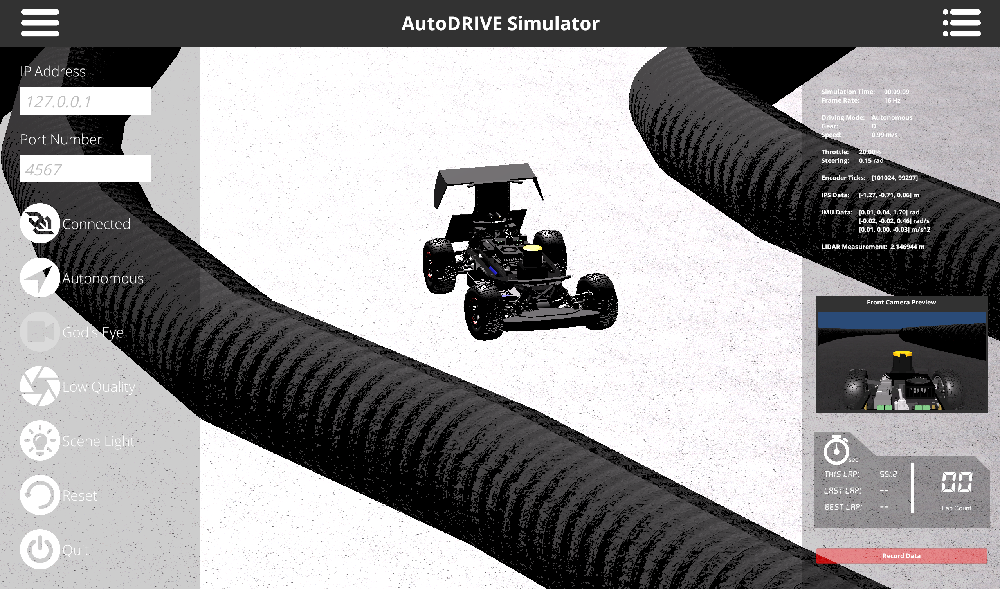

### F1Tenth Autonomous Racing

ROS2 implementation 

- All the packages are in ROS2 galactic

Launch file
```
ros2 launch autodrive_f1tenth simulator_bringup_headless.launch.py
```
---
Teleop Command
```
ros2 run autodrive_f1tenth teleop_keyboard
```
---


### Wall Follow
```
ros2 run wall_follow wall_follow
```

### Wall-Follow Snapshots:
<div style="display: flex;">
  
  
</div>

---


### Follow the Gap
```
ros2 run follow_gap follow_gap
```

Min Lap time:  **10.8sec**

**Note:** Lap time and crashes can vary based on system specifications, because of the inefficient loops in the code. {Code needs optimization}