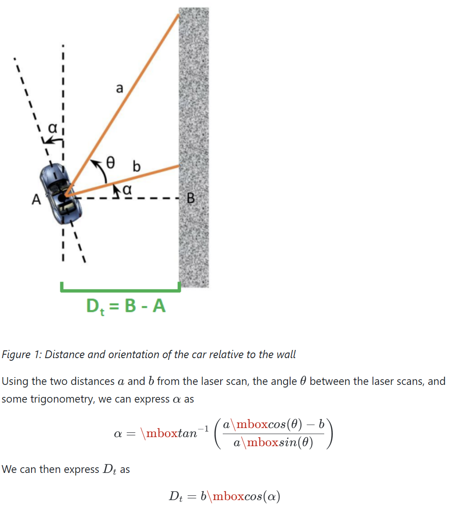
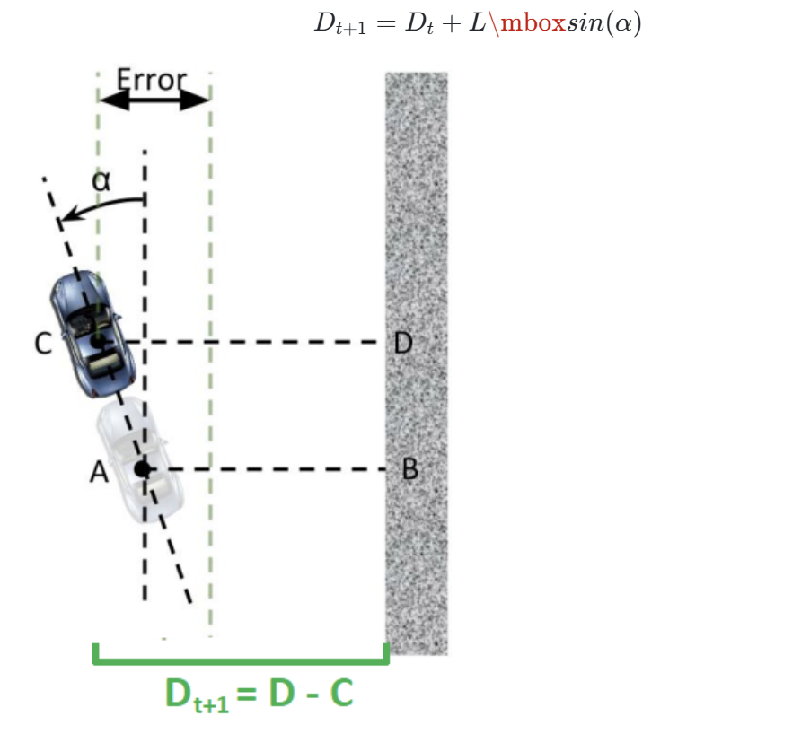

### F1Tenth Autonomous Racing

ROS2 implementation 

- All the packages are in ROS2 galactic

Launch file
```
ros2 launch autodrive_f1tenth simulator_bringup_headless.launch.py
```

Wall Follow
```
ros2 run wall_follow wall_follow
```


### Hokoyo 2D lidar:
We use hokoyo 2D lidar for wall following\
**Resolution**: 0.25 degrees #Meaning each lidar point is spaced every 0.25 degrees \
**Coverage**: 270 degrees 


### Concept
Consider only 2 Lidar ray "a" and "b"

"b": along y-axis of car \
"a": is at an angle $\theta$ with b where $\theta=[0, 70]$


Here $D_t$ is the distance to the wall, \
to find $D_t$, first find $\alpha$, then $D_t=bcos\alpha$

Since our car moves fast (races) we need lookahead distance $D_{t+1}$ which can be expressed as below

